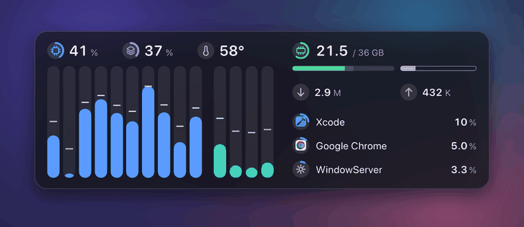
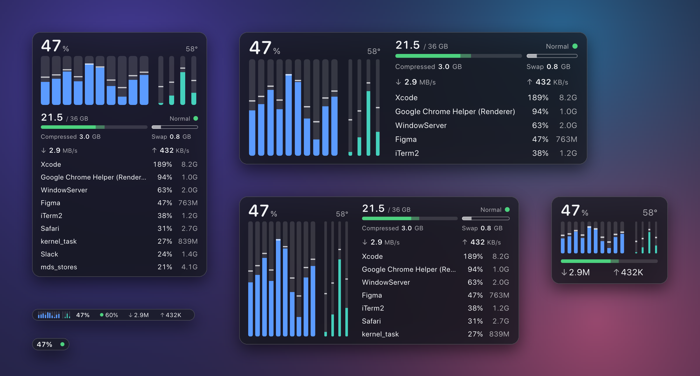
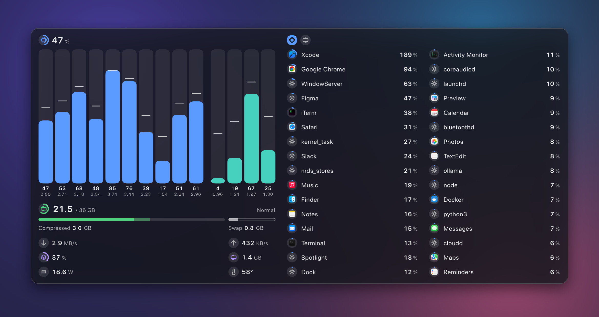
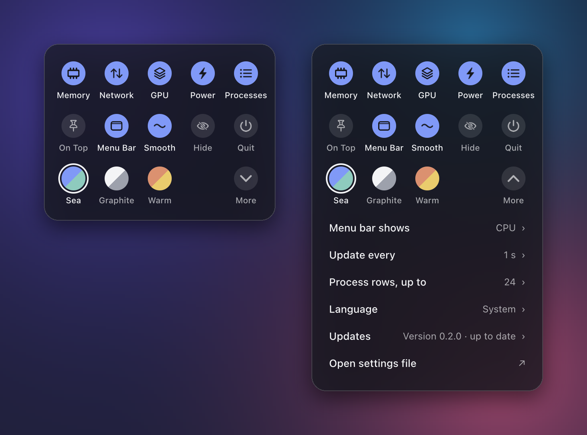

<p align="center"></p>
<h1 align="center">ftop</h1>
<p align="center">给 Apple Silicon Mac 用的一个小而安静的系统监视器。<br>一块浮动的玻璃面板，任何尺寸都能用。</p>
<p align="center">
  <a href="README.md">English</a> ·
  <a href="https://github.com/Nongfsq/ftop/releases/latest">下载</a> ·
  <a href="#安装">安装</a>
</p>

<p align="center"></p>

ftop 用来替代你常年开在终端标签页里的监视工具，换成一个可以放在桌面任何位置的原生
窗口。它为机器正在使劲干活的时刻而做：本地模型在跑、AI 代理在编译、一次很长的构建。
这时你想一眼看清各个核心、内存和网络的状态，以及是哪个应用在占用。

它只显示当前状态：没有历史曲线，没有磁盘面板。

## 一块面板，各种尺寸

拖动任何一条边，ftop 选出合适的布局，窗口随即贴合过去，所以内容不会被裁掉，也不会
留空白。小窗口只留要点；大窗口显示更多内容，而不是把字放大。



## 它显示什么

每个数字前面都是同一种小圆标，带圆弧的圆标是一个量表。颜色说明它属于谁，几乎没有
需要读的文字。

| | |
| --- | --- |
| **核心** | 每个核心一根柱子，芯片有几种核心就分几组，最快的在前。柱子高度是占用，小横线是该核心当前的频率。 |
| **内存** | 已用和总量、压缩、交换，以及系统自己给出的内存压力。 |
| **网络** | 当前的下载和上传速度。 |
| **GPU** | 占用和已用显存。悬停可看频率、功耗和温度。 |
| **功耗** | 整机功耗，单位瓦。 |
| **温度** | 只有一个数字，并标明它实际来自哪一级传感器。 |
| **进程** | 最忙的应用，带它们自己的图标，帮助进程并到所属应用里。应用的 CPU 是占整台机器的比例，和上方的总占用同一个单位，所以不会超过 100%（活动监视器以单个核心为 100%）。 |

硬件不提供的读数显示为“不可用”，绝不显示成 0。



## 手感

- **柱子跟着读数走。** 每个核心平滑地移到新值，并在下一次读数到来时到位，所以面板是
  连续在动，而不是每秒跳一下。
- **会停下来的列表。** 进程一变忙就立刻到位，安静下来后慢慢退下；两个应用只差一个点
  地交替领先时不会来回换位。越过相邻一行的行滑过去；走得更远的行在原地翻转，所以不会
  有行横穿整个列表。
- **按一下进程。** 这一行会在指针下微微凹下去，旁边浮出一张卡片：CPU、内存，以及这个
  应用里的帮助进程。窗口够大时，两个圆标可在按 CPU 和按内存排序之间切换。
- **不看的时候几乎不花资源。** 隐藏或被完全遮住时，除了菜单栏上那一个数字，其他读数
  全部停止。

在 macOS 里打开“减弱动态效果”后，以上动作都变成简单的淡入淡出。

## 设置

在面板或菜单栏数字上点右键。所有设置都在这一块里：显示哪些内容、面板的行为、配色，
以及**更多**里几项有数值的设置。

<p align="center"></p>

同样的设置也是一个纯文本文件 `~/.config/ftop/config.json5`（可以写注释的 JSON）。
两边保持一致，保存后立即生效。

## 开销

在一台 14 核 Apple Silicon Mac 上用 `scripts/perf.sh` 测得，每秒更新一次：

| 状态 | CPU | 内存 |
| --- | --- | --- |
| 小尺寸和中等尺寸 | 低于单核的 0.8% | 低于 30 MB |
| 最大的面板，32 行进程 | 约 0.9% | 约 52 MB |
| 隐藏或被完全遮住 | 0.0–0.1% | 同上 |

授权读取系统进程后（见下文），列出进程的辅助程序另占约 0.5%。

## 安装

要求：Apple Silicon Mac，macOS 15 或更新。

**用发布包。** 在[发布页](https://github.com/Nongfsq/ftop/releases/latest)下载
`Ftop-<版本>-arm64.zip`，解压后把 `Ftop.app` 移到 `~/Applications`。然后把命令链接到
`PATH` 里的某个目录：

```bash
mkdir -p ~/.local/bin && ln -sfn ~/Applications/Ftop.app/Contents/MacOS/ftop ~/.local/bin/ftop
```

这个应用只做了本机签名，没有经过苹果公证，所以用浏览器下载的副本会被 macOS 拦住。
清除一次下载标记即可：

```bash
xattr -dr com.apple.quarantine ~/Applications/Ftop.app
```

**从源码构建。** 需要 Xcode（用 Xcode 27 构建和测试）。

```bash
git clone https://github.com/Nongfsq/ftop.git
```

```bash
cd ftop && scripts/bundle.sh && scripts/install.sh
```

这会把 `Ftop.app` 放进 `~/Applications`，并把 `ftop` 链接到 `~/.local/bin`。

> **还在用 0.1.0？** 这一版不会自己更新。请按上面的步骤手动装一次最新版本；从 0.1.1
> 起 ftop 会自动保持最新。

## 使用

```bash
ftop            # 打开面板
ftop toggle     # 隐藏或显示
ftop quit       # 关闭
ftop doctor     # 这台 Mac 上哪些读数可用，不可用的原因是什么
```

- 拖动面板可以移动它；拖动边缘可以改变大小。
- 把指针移到面板顶部会出现两个按钮：置顶和隐藏。
- 菜单栏显示一项读数，一个图标加它的数字：默认是 CPU，也可以换成内存、GPU、下载、
  上传或功耗（在设置的「更多」里）。点一下可以显示或隐藏面板。
- 指针停在某个核心、内存条或 GPU 上，会显示详细信息；点一个进程会浮出它的卡片。
- 点右键打开设置。

### 更新

ftop 每天检查一次有没有新版本，有就自动安装：从本仓库下载发布包，校验后替换
`Ftop.app`，再重新打开面板。在**更多 → 更新**里可以改成"仅提示"（新版本会出现在那里）
或"不检查"（ftop 完全不联网）。`ftop update` 立即检查，`ftop version` 显示已安装的
版本。

更新不会改动 `sudo ftop grant` 安装的那个辅助程序。新版本需要更新它时，`ftop doctor`
会提示，再授权一次即可。

### 系统进程

没有额外权限时，macOS 只让 ftop 看到你自己的进程。要把 `WindowServer` 这类系统进程也
列出来，授权一次即可：

```bash
sudo ftop grant
```

这会把应用里的一个小辅助程序标记为以 root 身份运行。它不接受参数，不读环境变量，不写
文件，只输出进程表；源码在 `Sources/ftop-helper/main.swift`。

## 限制

- 只支持 Apple Silicon。核心分组和每核频率依赖它。
- 每核频率、温度、GPU 和功耗来自 macOS 的私有接口（IOReport、HID 传感器服务和 SMC），可能随系统更新
  而变化；读不到的数值会显示为不可用，绝不显示成零。也因为这一点，ftop 不能上架
  Mac App Store。
- 界面有英文和中文。

## 开发

`scripts/check.sh` 是提交前的检查：格式、无警告构建、测试。本页的图片由 ftop 自己的
绘制代码配合示例数据生成（`scripts/readme-media.sh`），放在一张替代的壁纸上；真实
窗口用的是 macOS 的玻璃材质，背景会随它后面的内容变化。产品决定在
[docs/product/](docs/product/)，架构在 [docs/architecture/](docs/architecture/)，
给编码代理的规则在 [AGENTS.md](AGENTS.md)。

ftop 最初是 [btop](https://github.com/aristocratos/btop) 的一个分支，之后从头重写，
与它不共享任何代码。

## 支持

ftop 免费且开源。如果它在你的桌面上留了下来，可以
请我喝杯咖啡。

<a href="https://buymeacoffee.com/frankmenger"></a>

## 许可证

[MIT](LICENSE)
